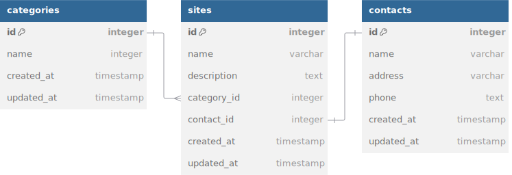

# Muslim Friendly API

API for listing categories, sites, and contacts for Muslim Friendly Taiwan tourism

## REST API Specification

- Production: <[https://taiwan-muslimfriendly-api.onrender.com/](https://taiwan-muslimfriendly-api.onrender.com/)>
- Local: <[http://localhost](http://localhost:3000/)>

| Endpoint           | HTTP     | Description            | Implemented |
| ------------------ | -------- | ---------------------- | ----------- |
| `/categories`      | `GET`    | Get all categories     | ✅          |
| `/categories/{id}` | `GET`    | Get one category by id | ✅          |
| `/categories`      | `POST`   | Add new category       | ✅          |
| `/categories/{id}` | `DELETE` | Delete site by id      | ✅          |
| `/sites`           | `GET`    | Get all sites          | ✅          |
| `/sites/{id}`      | `GET`    | Get one site by id     | ✅          |
| `/sites`           | `POST`   | Add new site           | ✅          |
| `/sites/{id}`      | `DELETE` | Delete sites by id     | ✅          |
| `/contacts`        | `GET`    | Get all contacts       | ✅          |
| `/contacts/{id}`   | `GET`    | Get one contact by id  | ✅          |
| `/contacts`        | `POST`   | Add new contact        | ✅          |
| `/contacts/{id}`   | `DELETE` | Delete contacts by id  | ✅          |

## ERD



## Getting Started

To install dependencies:

```sh
bun install
```

To run:

```sh
bun run dev
```

```sh
bun dev
```

Open <http://localhost:3000>
